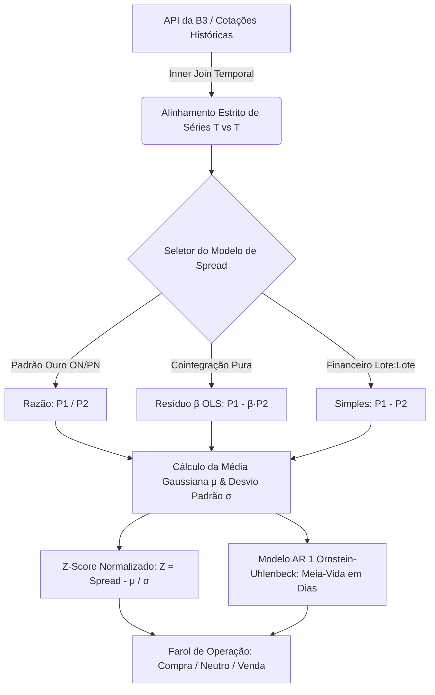

# 🚀 Apresentação Executiva & Walkthrough Técnico: SpreadTrader (App do Milhão)
**Terminal Quantitativo de Long & Short, Arbitragem Estatística e Cointegração da B3**

---

## 📋 1. Sumário Executivo & Proposta de Valor

O **SpreadTrader** é uma plataforma inovadora de análise quantitativa e negociação de pares de ações (**Pairs Trading / Long & Short**). Projetado com padrões de engenharia financeira e UX/UI de nível institucional (Wall Street & Faria Lima), o aplicativo transforma algoritmos estatísticos complexos em decisões de investimento claras, visuais e altamente assertivas.

### 💎 O Problema no Mercado
* **Risco Direcional do Mercado (Beta da Bolsa):** Investidores comuns dependem da alta geral do Ibovespa para lucrar. Quando a bolsa cai ou lateraliza, sofrem perdas severas.
* **Complexidade Matemática:** Cálculos de Cointegração, Regressão OLS, Z-Score e Meia-Vida (Processo de Ornstein-Uhlenbeck) são inacessíveis ao varejo sem terminais caríssimos (ex: Bloomberg / Reuters).
* **Viés Emocional:** Decisões baseadas em intuição, notícias ou gráficos subjetivos geram inconsistência e prejuízos no longo prazo.

### 🌟 A Solução: SpreadTrader
* **Operações Neutras ao Mercado (Market-Neutral):** Lucro gerado pelas **distorções relativas** entre dois ativos correlacionados, independentemente se a Bolsa está subindo ou caindo.
* **Automação & Tradução Simples:** O app processa em tempo real cotações da B3, alinha séries temporais, calcula o desvio padrão e exibe um **Farol Didático** de quando entrar e sair da operação.
* **Foco Específico em Pares ON/PN:** Aproveitamento cirúrgico do prêmio de liquidez e governança entre ações Ordinárias e Preferenciais da mesma empresa (ex: `PETR3 x PETR4`, `ITUB3 x ITUB4`).

---

## 🧠 2. Motor Quantitativo Institucional

O coração do **SpreadTrader** é um motor estatístico rigoroso, desenvolvido para eliminar erros de precisão e maximizar o *Alpha* das operações:

### 📐 1. Três Modelos de Cálculo do Spread (Precisão sob Medida)
1. **Razão ($P_1 / P_2$) — Recomendado & Padrão Ouro para ON/PN:**
   * **Por que usar:** Mede a proporção percentual relativa entre a ação Ordinária e Preferencial da mesma empresa. Evita distorções causadas pela variação nominal do preço da ação ao longo de meses ou anos, mantendo a curva de Z-Score puramente estacionária.
2. **Resíduo $\beta$-Neutro via Regressão OLS ($P_1 - \beta \cdot P_2$):**
   * **Por que usar:** Ideal para pares de empresas diferentes (ex: `VALE3 x CSNA3`). O coeficiente $\beta$ é estimado por Mínimos Quadrados Ordinários (*Ordinary Least Squares*), isolando o resíduo estatístico e garantindo imunidade total às flutuações do setor.
3. **Spread Simples ($P_1 - P_2$ em $R\$$):**
   * **Por que usar:** Subtração direta em Reais para operadores tradicionais que desejam montar posições na proporção exata de 1 lote contra 1 lote (1:1).

### 🔬 2. Métricas de Cointegração e Reversão à Média
* **Z-Score ($Z$):** Normalização matemática que indica exatamente quantos desvios padrões ($\sigma$) o spread atual está distante de sua média histórica ($\mu$).
  $$\text{Z-Score} = \frac{\text{Spread}_{\text{atual}} - \mu}{\sigma}$$
* **Meia-Vida (*Half-Life* via AR(1)):** Modelagem por autorregressão de primeira ordem que estima com alta confiabilidade **em quantos pregões (dias)** o spread esticado tenderá a fechar e retornar à média gaussiana.
* **R² & Correlação de Pearson:** Avaliação contínua da sinergia entre o comportamento dos dois ativos.

---

## 🖥️ 3. Jornada Executiva & Pipeline Multi-Abas

O aplicativo foi desenhado em um **pipeline de 6 etapas interligadas**, guiando o investidor desde o diagnóstico inicial até o backtest de rentabilidade e execução na corretora:

| Etapa / Aba | Função Principal | Diferencial Técnico / Visual |
| :--- | :--- | :--- |
| **⚡ Cockpit Executivo** | Farol instantâneo fixado no topo do painel. | Exibe status da conexão (`Dados Reais` da B3), sinal da operação (`🟢 LONG`, `🔴 SHORT` ou `⚪ NEUTRO`) e 4 KPIs rápidos (Correlação, Meia-Vida, Beta e Spread Atual). |
| **01. Diagnóstico** | Termômetro Didático do Z-Score e tradução em português simples. | Converte a matemática em um medidor visual com zona verde (compra a `-1.5σ`), zona cinza (neutra) e zona vermelha (venda a `+1.5σ`), além do **Indicador de Esticamento (0% a 100%)**. |
| **02. Gráficos & Z-Score** | Curva histórica do spread interativa e **Sino de Gauss**. | Gráficos com zoom em tempo real e um Histograma que sobrepõe a densidade teórica normal (Gaussiana) contra a frequência observada no pregão. |
| **03. Grade Gaussiana** | Estratificação por camadas de desvio (`0.5σ`, `1.0σ`, `2.0σ`). | Mapeia o **preço médio exato** de cada ação em cada camada de desvio, permitindo ordens escalonadas para acumulação institucional. |
| **04. Calculadora** | Dimensionamento financeiro de posições Long & Short. | Calcula automaticamente a quantidade de lotes da ponta compradora e vendedora, exposição financeira total, exigência de margem de garantia e lucro estimado na volta à média. |
| **05. Backtest** | Simulação algorítmica de todas as operações do período. | Realiza o teste retrospectivo automático: entra no desvio extremo (`±1.5σ`) e encerra no retorno à média (`0σ`), exibindo **Taxa de Acerto (Win Rate)** e lucro acumulado. |
| **06. Watchlist** | Monitoramento simultâneo de múltiplos pares. | Painel multi-pares pré-selecionados (`PETR3/PETR4`, `ITUB3/ITUB4`, `BBDC3/BBDC4`, `GGBR3/GGBR4`, etc.) para identificar distorções na bolsa em segundos. |

---

## 📱 4. UX/UI Premium & Responsividade Total (Desktop + Mobile)

O design visual do **SpreadTrader** foi projetado para encantar no primeiro olhar, utilizando as melhores práticas da engenharia de software moderna:

* **Aestética Glassmorphism & High Contrast:** Superfícies translúcidas com bordas luminosas em ciano e violeta (`#06B6D4` e `#8B5CF6`), fundo dark mode ultra-limpo para conforto visual de traders profissionais e micro-animações em tempo real.
* **Responsividade Pura (Smartphones, Tablets e Desktops):**
  * **No Desktop:** Layout amplo com cards lado a lado e visão panorâmica de todos os indicadores e gráficos.
  * **No Smartphone:** Grade inteligente (`Grid Adaptativa`) com seletores em largura total (`w-full`), tabelas com rolagem horizontal suave anti-quebra (`overflow-x-auto`) e abreviação inteligente dos rótulos para acompanhamento ágil na palma da mão.
* **Modo Escuro / Claro (Dark & Light Mode):** Alternância instantânea de tema para adaptação a qualquer ambiente de operação.

---

## 🔒 5. Segurança Institucional & Preparação para Monetização

O projeto já contempla as bases sólidas para a transição para um modelo **SaaS (Software as a Service) com compras in-app**:

1. **Proteção Absoluta de Credenciais (`.env.local`):**
   * A chave de API da B3 (`brapi.dev`) é oculta e protegida, nunca ficando exposta em texto plano no código fonte do cliente.
2. **Arquitetura Pronta para Pagamentos & Paywall:**
   * Modularidade limpa no Next.js/React, permitindo o acoplamento imediato de gateways de pagamento (Stripe, Mercado Pago ou Asaas).
   * Estrutura preparada para liberação de funcionalidades exclusivas em planos **Pro / VIP** (ex: alertas automáticos de Z-Score via Telegram/WhatsApp, backtests de longo prazo e modelos quantitativos avançados).

---

## 🏆 6. Conclusão para o Investidor

O **SpreadTrader** une **rigor matemático de fundo quantitativo**, **design de software de classe mundial** e um **apelo de mercado massivo** (educação financeira avançada + ferramenta de execução profissional). É a plataforma definitiva para democratizar o Long & Short de alta performance na B3 com total transparência estatística e segurança.
